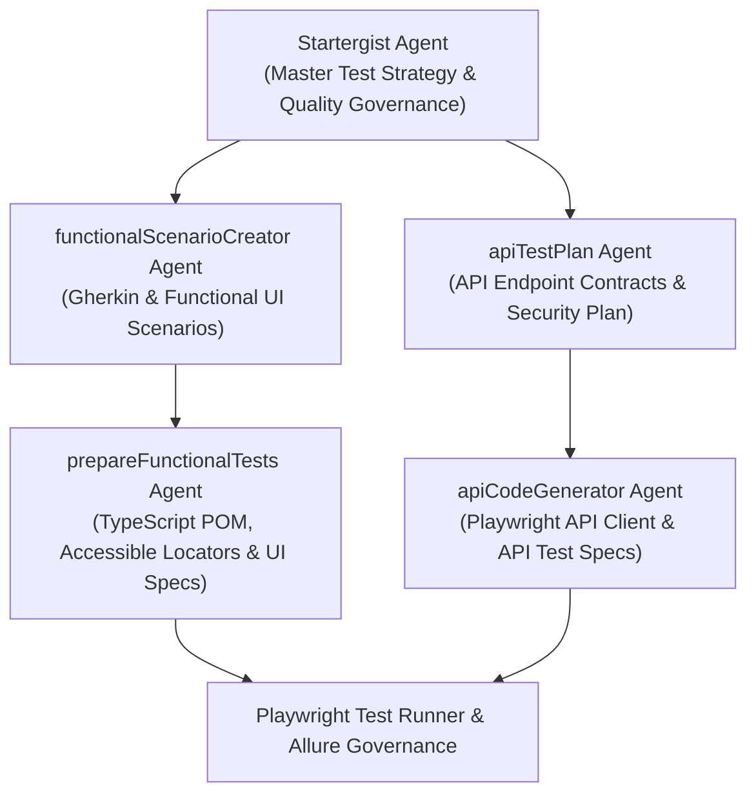

<!-- Author: Raveen -->

# Enterprise Playwright Automation Framework

This project is a Playwright-based test automation framework designed to help teams validate web applications quickly, consistently, and with clear reporting. It combines browser automation, reusable page objects, test data management, traceability tracking, and quality gates in a simple enterprise-ready structure.

## What this product does

- Automates browser-based test flows for web applications
- Provides reusable page objects for maintainable tests
- Supports login, smoke, and functional validation scenarios
- Keeps test data and environment configuration centralized
- Tracks requirements, scenarios, and automation status in one place
- Enforces linting and TypeScript checks before execution

## Who this is for

- New users onboarding to the project
- QA engineers and automation engineers
- Developers validating application behavior
- Teams who need a simple and structured automation setup

By the end of this guide, you should be able to:

- Set up the project locally
- Understand the folder structure
- Prepare the required environment and test data
- Run the smoke workflow
- Review results and reports
- Troubleshoot common issues

---

## Prerequisites / Before You Start

### System requirements

| Requirement      | Recommended                  |
| ---------------- | ---------------------------- |
| Operating System | Windows 10+, macOS, or Linux |
| Node.js          | 18 or newer                  |
| Package Manager  | npm                          |
| Browser Support  | Chromium, Firefox, WebKit    |
| Memory           | 8 GB RAM or more             |
| Disk Space       | At least 5 GB free           |

### Tools and access needed

- Git installed locally
- Node.js and npm installed
- Access to the project repository
- Access to the application or local app URL
- Optional: credentials for login flows if the application requires them
- Optional: CI/CD access for pipeline execution

### Installation and setup

1. Clone the repository:

   ```bash
   git clone <repository-url>
   cd <repository-folder>
   ```

2. Install dependencies:

   ```bash
   npm install
   ```

3. Install Playwright browsers:

   ```bash
   npx playwright install --with-deps
   ```

4. Validate the project before using it:

   ```bash
   npm run quality-gate
   ```

### Folder structure overview

```text
.
├── .github/
│   ├── agents/
│   └── prompts/
├── ci/
│   └── github-actions.yml
├── docs/
│   ├── traceability-tracker.md
│   └── test-strategy-template.md
├── fixtures/
│   └── test-data.ts
├── locators/
│   └── common.locators.ts
├── pages/
│   ├── base.page.ts
│   ├── login.page.ts
│   └── dashboard.page.ts
├── public/
│   ├── index.html
│   └── login.html
├── scripts/
│   └── traceability.mjs
├── tests/
│   ├── smoke.spec.ts
│   ├── auth.spec.ts
│   ├── security.spec.ts
│   ├── boundary.spec.ts
│   └── api.spec.ts
├── utils/
│   ├── auth.ts
│   └── api-client.ts
├── .githooks/
│   └── pre-commit
├── eslint.config.mjs
├── package.json
├── playwright.config.ts
├── tsconfig.json
├── LICENSE
├── CONTRIBUTING.md
├── CODE_OF_CONDUCT.md
├── SECURITY.md
├── README.md
├── UserGuide.md
├── .traceability-events.json
└── .gitignore
```

---

## AI Agents & Dual-Track Automation Architecture

This repository incorporates an AI Agent ecosystem architected into two specialized validation tracks anchored by a master strategy engine:



### 1. Functional & UI Track

- **`Startergist`** ([.github/agents/startergist.agent.md](.github/agents/startergist.agent.md)): Produces enterprise quality strategies, risk priorities, and governance metrics.
- **`functionalScenarioCreator`** ([.github/agents/functionalScenarioCreator.agent.md](.github/agents/functionalScenarioCreator.agent.md)): Generates traceable Gherkin specifications and detailed UI test cases.
- **`prepareFunctionalTests`** ([.github/agents/prepareFunctionalTests.agent.md](.github/agents/prepareFunctionalTests.agent.md)): Translates functional designs into Playwright Page Objects (`pages/`) and test specs (`tests/smoke.spec.ts`, `tests/auth.spec.ts`, `tests/security.spec.ts`, `tests/boundary.spec.ts`).

### 2. API Automation Track

- **`apiTestPlan`** ([.github/agents/apiTestPlan.agent.md](.github/agents/apiTestPlan.agent.md)): Analyzes endpoints and designs contract, negative, and OWASP API Top 10 security test plans.
- **`apiCodeGenerator`** ([.github/agents/apiCodeGenerator.agent.md](.github/agents/apiCodeGenerator.agent.md)): Implements executable Playwright `APIRequestContext` tests and reusable helpers (`utils/api-client.ts`, `tests/api.spec.ts`).

---

---

## Quick Start (Close → Prepare → Execute → Report)

### Close

- [ ] Open the repo in a terminal
- [ ] Confirm Node.js and npm are installed
- [ ] Run `npm install`
- [ ] Run `npx playwright install --with-deps`
- [ ] Confirm the workspace is ready for execution

Example:

```bash
cd <repository-folder>
npm install
npx playwright install --with-deps
```

### Prepare

- [ ] Review `playwright.config.ts`
- [ ] Confirm the application URL is reachable
- [ ] Check test data in `fixtures/test-data.ts`
- [ ] Verify environment variables if the app requires them
- [ ] Confirm the app login screen is accessible

Example local URL:

```text
http://127.0.0.1:4173
```

### Execute

Use the main scripts from `package.json`:

```bash
npm run quality-gate
npx playwright test --project=chromium --reporter=line
```

Common commands:

```bash
npm test
npm run test:smoke
npx playwright test tests/smoke.spec.ts --project=chromium --reporter=line
```

### Report

- [ ] Review the terminal output
- [ ] Check screenshots, traces, and failure artifacts
- [ ] Open the report if needed
- [ ] Update the traceability tracker if relevant
- [ ] Share results with stakeholders or teammates

Useful reporting commands:

```bash
npx playwright show-report
npm run report
```

---

## Detailed Workflow Explanation

### Stage 1: Close

Purpose:

- Prepare the local environment
- Install dependencies and browser binaries
- Confirm the workspace is healthy before execution

Expected output:

- Dependencies installed without errors
- Browser engines available for Playwright
- Project ready for tests

Common mistakes:

- Missing Node.js version
- Running commands from the wrong directory
- Skipping browser installation

### Stage 2: Prepare

Purpose:

- Validate configuration and app readiness
- Ensure test inputs match the app under test
- Confirm the environment is stable before automation begins

Expected output:

- Configuration ready
- App URL reachable
- Test data valid and centralized

Common mistakes:

- Using the wrong base URL
- Editing runtime data without checking fixtures
- Starting tests before the app is running

### Stage 3: Execute

Purpose:

- Run the test automation flow
- Validate login and key user journeys
- Detect functional failures early

Expected output:

- Summary in terminal
- Browser outputs and traces
- Pass/fail status for each scenario

Example execution:

```bash
npm run quality-gate
npx playwright test tests/smoke.spec.ts --project=chromium --reporter=line
```

### Stage 4: Report

Purpose:

- Review the outcomes clearly
- Capture evidence for QA or release checkpoints
- Preserve runtime and traceability history

Expected output:

- Pass/fail summary
- Log and report artifacts
- Updated test status records

---

## Troubleshooting

### npm install fails

```bash
npm install --legacy-peer-deps
```

### Playwright browsers missing

```bash
npx playwright install --with-deps
```

### App not reachable

- Confirm the app is running
- Check the URL in `playwright.config.ts`
- Use the expected local URL such as `http://127.0.0.1:4173`

### Lint or typecheck fails

```bash
npm run quality-gate
```

Typical fixes:

- Remove unused imports
- Use proper type imports
- Fix config typing issues
- Correct invalid assumptions in selectors or assertions

### Tests fail across browsers only

- Run one browser first for debugging
- Check selectors for browser-specific behavior
- Prefer stable locators and explicit waits

---

## Best Practices

- Keep tests readable and action-based
- Store shared user data in `fixtures/test-data.ts`
- Keep page logic in `pages/`
- Keep reusable utilities in `utils/`
- Run smoke checks before broad regression runs
- Keep report artifacts and traces for failures
- Use a clean, consistent naming pattern for files and scenarios

---

## FAQ

### What is this project for?

This is a Playwright-based automation framework for validating web app behavior with structured test execution and reporting.

### Do I need any special setup?

You need Node.js, npm, Git, and Playwright browsers installed.

### How do I run the smoke test?

```bash
npx playwright test tests/smoke.spec.ts --project=chromium --reporter=line
```

### Where should I update test data?

Use `fixtures/test-data.ts` for shared users and scenario inputs.

### Where do I review results?

Use terminal output, failure screenshots, traces, and the Playwright report viewer.

---

## Support & Contribution

### Getting help

- Review this README
- Check the repo docs and traceability files
- Inspect existing tests and page objects for patterns
- Review error logs and trace artifacts

### Reporting issues

Include:

- problem summary
- steps to reproduce
- command used
- screenshots or logs
- expected vs actual result

### Contributing

1. Create a feature branch
2. Make a focused change
3. Run the quality gate and relevant tests
4. Submit a clear pull request with a concise summary

Example:

```bash
git checkout -b feature/my-change
npm run quality-gate
npx playwright test tests/smoke.spec.ts --project=chromium --reporter=line
```

---

## Documentation index

- [UserGuide.md](UserGuide.md) — user onboarding guide
- [docs/test-strategy-template.md](docs/test-strategy-template.md) — reusable strategy template
- [docs/traceability-tracker.md](docs/traceability-tracker.md) — coverage and lifecycle tracking

## CI/CD

The repository includes pipeline examples in `ci/` for GitHub Actions and other enterprise automation runners.
